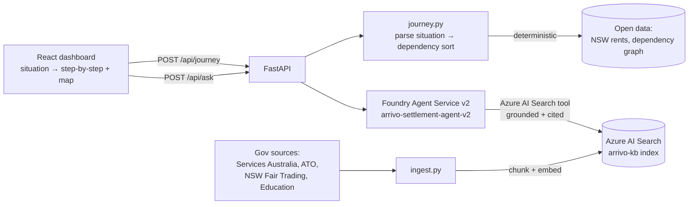
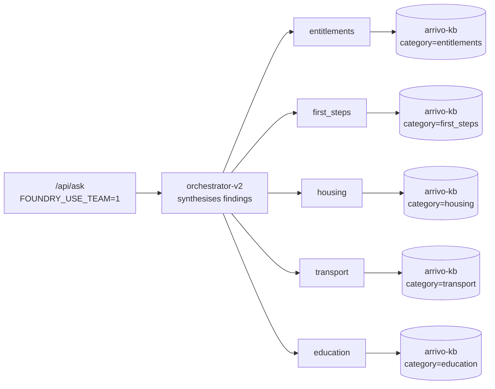
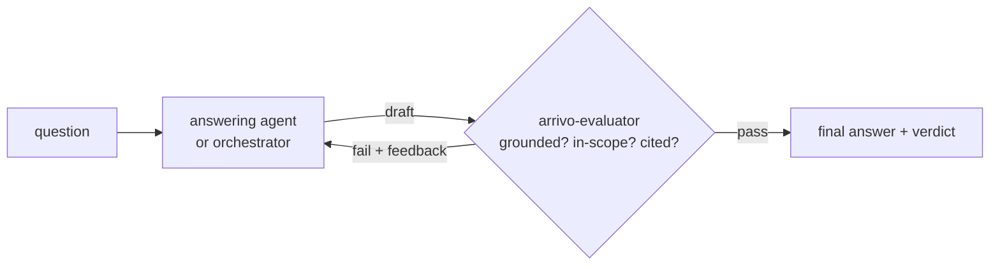

# Arrivo 🦘

## **Your first 60 days in Australia, reasoned out — with sources.**


https://github.com/user-attachments/assets/6295bfda-9fb9-4f14-985d-2a19de5c47d2


Arrivo is a settlement-planning reasoning agent for new migrants arriving in Australia.
You describe your situation (visa subclass, family, budget, where you'll work) and the
agent reasons — step by step, with citations from official government sources — through
what you're entitled to, where you can afford to live, and the exact order to do things
in (because in Australia, the order matters: a lease wants payslips, payslips want a TFN,
a TFN wants a phone number...).

Built for the **Reasoning Agents track** of Microsoft Agents League 2026, on
**Microsoft Foundry** with a **Foundry IQ-style grounded knowledge base** (Azure AI Search
over public government settlement documents).

> ⚠️ **Scope guard:** Arrivo provides settlement *logistics* information only. It never
> gives migration or visa advice — in Australia that legally requires a MARA-registered
> agent. The agent enforces this boundary in its system prompts and refuses out-of-scope
> questions. See [mara.gov.au](https://www.mara.gov.au).

## Why this is a *reasoning* agent, not a chatbot

1. **Multi-step pipeline with a visible trace.** Classify visa → ground entitlements →
   match suburbs → topologically sort the settlement dependency graph → enrich hard steps
   → verify. Every step writes to a reasoning trace shown in the UI.
2. **Grounded or silent.** Every factual claim must carry a citation from the knowledge
   base. When sources are insufficient, the agent returns `INSUFFICIENT_EVIDENCE` and says
   what official source is needed — it abstains rather than hallucinating.
3. **Deterministic where determinism wins.** Budget filtering and step ordering are code
   (`graphlib.TopologicalSorter`), not vibes. The LLM explains; the graph decides.

## Architecture



### Two ways Arrivo uses the knowledge

1. **The step-by-step program** (`/api/journey`) — you describe your situation in plain
   language ("I'm 25 with my partner, both on student visas — where do I start?"). Arrivo
   interprets your visa/family/budget, **topologically sorts the settlement dependency
   graph** into a phased, ordered plan, and attaches official sources + budget-matched
   suburbs for the map. Deterministic, so the React UI stays instant and reactive.
2. **The Foundry agent** (`/api/ask`) — a persistent agent on the **Microsoft Foundry
   Agent Service** (new v2 experience) whose only tool is an **Azure AI Search connection**
   over the `arrivo-kb` index. This is the Foundry IQ integration powering the in-app chat:
   it retrieves, grounds, and cites entirely through Foundry, and abstains
   (`INSUFFICIENT_EVIDENCE`) when the knowledge base falls short. A reflection loop with the
   `arrivo-evaluator-v2` agent vets each answer. Created with `python foundry/create_v2.py`.

> The older `/api/plan` LLM pipeline (Azure OpenAI + Search) is still available as an API,
> but the UI now leads with the faster deterministic `/api/journey` program + the agent chat.

### Multi-agent option — an orchestrator + domain specialists

Instead of one generalist agent, you can run a **team**: a high-level **orchestrator**
plus five **specialists**, each grounded on only its slice of `arrivo-kb` (via an Azure
AI Search `category` filter). On the v2 surface this is **code-orchestrated** — the
backend calls every specialist, then the orchestrator synthesises their cited findings
into one ordered answer:



Create the team with `python foundry/create_v2.py --team`, then set `FOUNDRY_USE_TEAM=1`
in `backend/.env` so `/api/ask` and `foundry/ask.py` route through the orchestrator.

> Built on the **new Foundry experience (v2 Agents)**: agents are created with
> `create_version` (`PromptAgentDefinition`) and run through the **Responses API**
> (conversations → responses), migrated from the classic Assistants API.

### Reflection — an evaluator vets every answer before it's returned

`/api/ask` runs a **reflection loop** when an evaluator agent is configured (created
automatically by `create_v2.py`). A separate **`arrivo-evaluator-v2`** agent — with its
own Azure AI Search tool over the full index — critiques the draft:



The evaluator returns a JSON verdict (`pass`, `score`, `issues`, `suggestions`,
`unsupported_claims`). If it fails — out-of-scope migration advice, a confidently
stated unsupported claim, or a fabricated source/figure — the draft is sent back for
one revision, then re-checked. `/api/ask` returns the vetted answer plus the
`evaluation` and a `reflection_trace` of each attempt (great for the demo and the
"Reliability & Safety" rubric). Disable per-request with `{"reflect": false}`.

## Quickstart

```bash
# 0. Prereqs: Azure subscription, az CLI logged in, Python 3.11+
git clone <this repo> && cd arrivo

# 1. Deploy infrastructure (Bicep: Foundry account + project + models + AI Search
#    + the project→Search connection the agent grounds on) — ~5 min
bash scripts/deploy.sh          # writes backend/.env with endpoints + keys

# 2. Install deps
pip install -r backend/requirements.txt

# 3. Build the knowledge base from official sources
cd ingestion && python ingest.py && cd ..
#    (if a site blocks scraping, save the page text into ingestion/docs/
#     as "<category>__<title>.txt" and run: python ingest.py --local)

# 4. Create the Foundry agents over that knowledge (writes the agent names to .env)
python foundry/create_v2.py
#    ...add the multi-agent team (orchestrator + specialists) too:
#    python foundry/create_v2.py --team   (then set FOUNDRY_USE_TEAM=1)
python foundry/ask.py "How do I enrol in Medicare as a new permanent resident?"

# 5. Run
cd backend && uvicorn app:app --reload
# open http://localhost:8000 — describe your situation → step-by-step plan + map,
#                              then chat with the grounded agent (floating assistant)
```

Estimated Azure cost for full development + demo: **under AUD $5**
(gpt-4o-mini + text-embedding-3-small + free-tier AI Search).

## Judging rubric mapping

| Criterion | How Arrivo addresses it |
|---|---|
| Accuracy & Relevance (20%) | Every claim cited to official government sources; open NSW rent data clearly labelled as indicative |
| Reasoning & Multi-step (20%) | 6-step pipeline, dependency-graph topological ordering, full visible trace |
| Creativity & Originality (15%) | The only settlement-logistics agent in the field; AU-grounded |
| UX & Presentation (15%) | React dashboard: plain-language situation intake → reactive phased step-by-step program, progress tracking, beautified route map, toggleable grounded AI chat with verification + sources |
| Reliability & Safety (20%) | Abstention on insufficient evidence; unknown-visa fallback; MARA legal scope guard; no fabricated listings |

## Repo layout

```
infra/        Bicep IaC (Foundry account + project, model deployments, AI Search, agent's Search connection)
scripts/      deploy.sh — one-shot provision + .env generation + RBAC
ingestion/    knowledge-base builder + source list
foundry/      Foundry Agent Service (v2): single grounded agent + code-orchestrated team
              (create_v2.py, v2.py, specialists.py); evaluator/reflection (evaluator.py);
              ask.py CLI; shared helpers (common.py, instructions.py, envfile.py)
backend/      FastAPI app: step-by-step journey (/api/journey, journey.py), Foundry agent
              chat (/api/ask), plan pipeline (/api/plan, agent.py), map data (/api/locations)
frontend/     React app (CDN + Babel, no build) — index.html + styles.css + app.jsx:
              situation intake → reactive dashboard (phased stepper, stat cards, Leaflet map)
              + toggleable AI chat dock
data/         open suburb rent data + settlement dependency graph
docs/         demo video script
```

## Honest limitations

- Rent figures are indicative medians, not live listings (live listing APIs require
  commercial approval). The agent says so rather than pretending.
- Knowledge base covers NSW; other states would need their sources ingested.
- Visa subclass mapping covers common subclasses; anything else triggers abstention.

## Docker / Local development with Docker

This repo can be run locally using Docker and docker-compose. The frontend is served
by `nginx` and proxies `/api` to the backend FastAPI service so the single-origin
UI can call the API without extra configuration.

Files added:
- `backend/Dockerfile` — builds the Python FastAPI backend (uses `backend/requirements.txt`).
- `frontend/Dockerfile` — builds an `nginx` image serving the static frontend and using
   `frontend/nginx.conf` to proxy `/api` to the backend service in compose.
- `docker-compose.yml` — builds and runs both services together.

Quick start (from the repo root):

```bash
# Build and run both services (first run may take a few minutes):
docker-compose up --build

# Frontend (UI): http://localhost:3000
# Backend API (direct): http://localhost:8000 (useful for debugging)
```

Notes:
- The frontend's in-browser Babel transpiles `app.jsx` at runtime — there's no JS build
   step. The nginx config falls back to `index.html` so client-side routing works.
- Environment variables for the Foundry agents and Azure connections still need to be
   provided to the backend. Use your existing `backend/.env` (created by `scripts/deploy.sh`) or
   pass environment variables via the `docker-compose.yml` if you prefer.
- For production, tune the nginx cache headers, add TLS, and pin image versions.

Running with environment variables (recommended)

1. Create a local `.env` for the backend by copying the example and filling in values:

```bash
cp backend/.env.example backend/.env
# Edit backend/.env and supply your Azure / Foundry values (or set FOUNDRY_USE_TEAM=0 to disable team mode)
```

2. The provided `docker-compose.yml` does not automatically load `backend/.env`. There are two simple options:

- Option A (preferred): Create a `docker-compose.override.yml` in the repo root to point the backend at `backend/.env`:

```yaml
version: '3.8'
services:
  backend:
    env_file:
      - ./backend/.env
```

Then run:

```bash
docker-compose -f docker-compose.yml -f docker-compose.override.yml up --build
```

- Option B: Export the required environment variables into your shell before running `docker-compose up`.

Notes on minimal testing: if you don't have Foundry/Azure keys yet but want to test the UI/layout locally, set `FOUNDRY_USE_TEAM=0` and leave other keys blank; the backend will still start but grounded features will be disabled or return abstentions.

If you prefer to pass an env-file directly to the backend service with `docker run`, use:

```bash
docker compose build
docker compose up -d
# or: docker run --env-file backend/.env -p 8000:8000 <backend-image>
```

